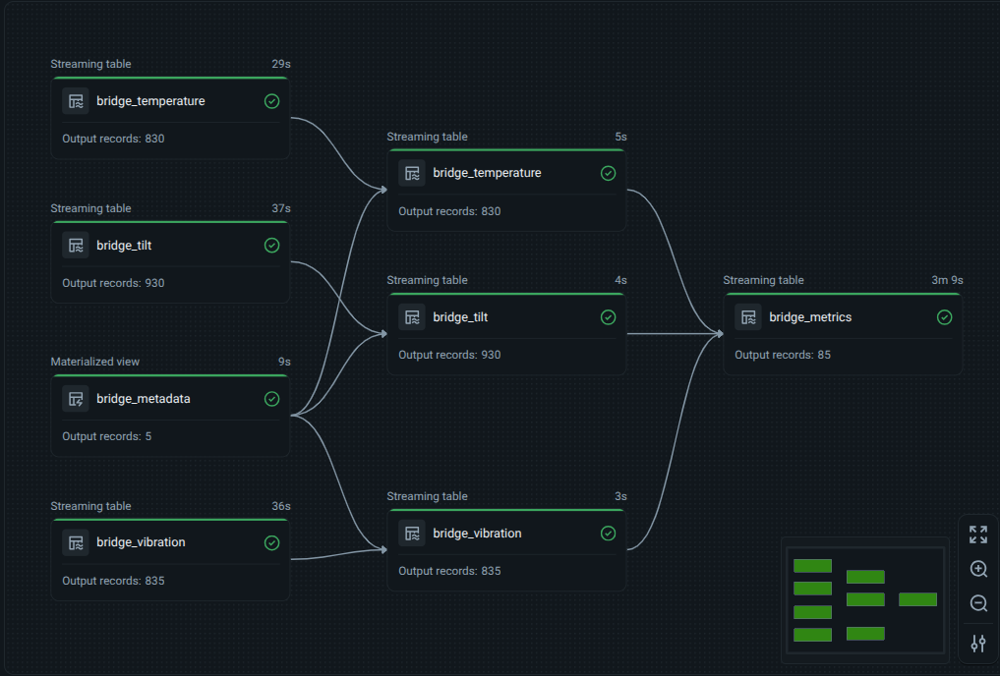

# Real-Time Streaming ETL with Delta Live Tables on Databricks

This project demonstrates an end-to-end streaming ETL pipeline on Databricks using Delta Lake and Delta Live Tables (DLT). It simulates IoT-style bridge sensor data, lands that data as Delta streams, and transforms it through bronze, silver, and gold layers.

The pipeline models telemetry for five bridges and processes three sensor streams:

- `temperature`
- `vibration`
- `tilt_angle`

## Architecture

The project follows the medallion architecture:

1. `00_data_generator.py`
   Continuously generates synthetic bridge telemetry and appends it to Delta paths in a Unity Catalog volume.
2. `01_bronze_processing.py`
   Ingests the raw Delta streams into DLT bronze tables.
3. `02_silver_processing.py`
   Adds data quality checks, standardizes fields, and enriches each stream with bridge metadata.
4. `03_gold_processing.py`
   Produces 10-minute aggregated bridge metrics for downstream analytics.

## Repository Structure

- [00_data_generator.py](/home/jalis/Desktop/Real-Time-Streaming-ETL-with-Delta-Live-Tables-on-Databricks-End-To-End/00_data_generator.py)
- [01_bronze_processing.py](/home/jalis/Desktop/Real-Time-Streaming-ETL-with-Delta-Live-Tables-on-Databricks-End-To-End/01_bronze_processing.py)
- [02_silver_processing.py](/home/jalis/Desktop/Real-Time-Streaming-ETL-with-Delta-Live-Tables-on-Databricks-End-To-End/02_silver_processing.py)
- [03_gold_processing.py](/home/jalis/Desktop/Real-Time-Streaming-ETL-with-Delta-Live-Tables-on-Databricks-End-To-End/03_gold_processing.py)

## Data Flow

### 1. Streaming Data Generation

`00_data_generator.py` creates three continuous Delta streams using a thread per sensor type. Each batch:

- emits records for `device_id` values `1..5`
- assigns a UTC `event_time`
- injects up to 60 seconds of lateness
- appends records every 60 seconds

The generator writes to these Delta locations:

- `/Volumes/bridge_data_monitor/00_landing/streaming/bridge_temperature`
- `/Volumes/bridge_data_monitor/00_landing/streaming/bridge_vibration`
- `/Volumes/bridge_data_monitor/00_landing/streaming/bridge_tilt`

### 2. Bronze Layer

`01_bronze_processing.py` ingests the raw Delta streams into these DLT tables:

- `01_bronze.bridge_temperature`
- `01_bronze.bridge_vibration`
- `01_bronze.bridge_tilt`

This layer preserves the raw incoming structure with minimal transformation.

### 3. Silver Layer

`02_silver_processing.py` creates a static metadata table and three enriched streaming tables.

Static metadata table:

- `02_silver.bridge_metadata`

Streaming silver tables:

- `02_silver.bridge_temperature`
- `02_silver.bridge_vibration`
- `02_silver.bridge_tilt`

Key transformations:

- casts `event_time` to `timestamp`
- renames `device_id` to `bridge_id`
- joins each stream with bridge metadata
- selects analytics-friendly columns such as `name` and `location`

Data quality expectations:

- `event_time IS NOT NULL`
- `temperature BETWEEN -20 AND 60`
- `vibration BETWEEN 0 AND 0.1`
- `tilt_angle BETWEEN -0.005 AND 0.005`

Rows with invalid timestamps are dropped where `expect_or_drop` is used.

### 4. Gold Layer

`03_gold_processing.py` builds the final analytics table:

- `03_gold.bridge_metrics`

This table:

- applies a `2 minutes` watermark to each silver stream
- computes 10-minute tumbling window aggregates
- calculates `avg_temperature`
- calculates `max_vibration`
- calculates `max_tilt_angle`
- joins the aggregates by `bridge_id`, `window_start`, and `window_end`

Final output columns:

- `bridge_id`
- `name`
- `location`
- `window_start`
- `window_end`
- `avg_temperature`
- `max_vibration`
- `max_tilt_angle`

## Bridge Metadata Included

The silver metadata table contains five sample bridges:

- Millau Viaduct
- Vasco da Gama Bridge
- Øresund Bridge
- 15 July Martyrs Bridge
- Forth Bridge

## How to Run

### Prerequisites

- A Databricks workspace
- Delta Live Tables enabled
- Access to Unity Catalog volumes
- A catalog, schema, and volume structure that supports:
  `bridge_data_monitor/00_landing/streaming/...`

### Recommended Execution Order

1. Run `00_data_generator.py` on a Databricks cluster or notebook to start writing streaming data.
2. Create a Delta Live Tables pipeline.
3. Add the bronze, silver, and gold notebooks/scripts to the DLT pipeline.
4. Start the DLT pipeline and let it process incoming Delta data.
5. Query the gold table for aggregated bridge monitoring metrics.

## Example Output Use Cases

This pipeline can be used as a template for:

- real-time infrastructure monitoring
- sensor anomaly dashboards
- medallion architecture demos
- streaming ETL demonstrations in Databricks

## Notes

- The generator runs indefinitely until manually stopped.
- The gold layer uses inner joins across the three aggregated streams, so a record appears only when all three sensor aggregates exist for the same bridge and time window.
- The project is written in Databricks notebook-style Python files and is intended to run inside Databricks rather than as a standalone local Python application.
